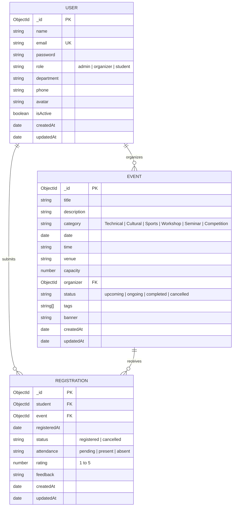

# 📊 Advanced Database Management Systems (ADBMS) Documentation
## College Event Management System (CEMS)

> **Coursework & Viva Examination Reference Document**  
> **Database Engine:** MongoDB 7.0+ / MongoDB Atlas Cloud  
> **Object Data Modeling (ODM):** Mongoose 8.x  
> **Application Layer:** Express.js REST API + TailAdmin React Client

---

## 1. Executive Summary & Database Paradigm

The **College Event Management System (CEMS)** manages campus events, faculty organizers, student registrations, attendance tracking, and satisfaction feedback.

In relational databases (RDBMS), hierarchical or polymorphic event data (varying categories, tags, dynamic schedules) often leads to rigid schemas and performance degradation from deep foreign key joins. **MongoDB** was chosen as the primary database management system because:
1. **Document Data Model**: Native JSON-like BSON documents naturally represent rich event structures, embedded arrays (e.g. event tags), and flexible nested documents.
2. **Horizontal Scalability & High Concurrency**: Peak traffic during event registration openings is handled through MongoDB's high write throughput and configurable sharding capabilities.
3. **Mongoose Object Data Modeling (ODM)**: Provides strict application-level schema enforcement, middleware lifecycle hooks (e.g., automated `bcrypt` password hashing), and virtual population.
4. **Powerful Native Aggregation Framework**: Multi-stage analytics pipelines enable real-time OLAP-style reporting directly inside the database engine without external ETL systems.

---

## 2. Data Modeling Strategy: Referencing vs. Embedding

A fundamental decision in MongoDB schema design is choosing between **Document Embedding (Denormalization)** and **Document Referencing (Normalization)**.

| Consideration | Embedding Approach (Rejected) | Referencing Approach (Selected) | Rationale |
| :--- | :--- | :--- | :--- |
| **Registrations within Events** | Embed array of `registrations: [...]` inside `events` doc | Separate `registrations` collection with `event` ObjectId | Large campus hackathons or sports meets can exceed thousands of participants. Unbounded arrays risk reaching MongoDB's **16MB BSON document size limit** and cause excessive memory fragmentation during in-place growth. |
| **Registrations within Students** | Embed array of `registeredEvents: [...]` inside `users` doc | Separate `registrations` collection with `student` ObjectId | Frequent state transitions (e.g., attendance marked `present`, rating submitted) would require locking the entire student profile document. |
| **Faculty Organizer in Event** | Embed full organizer user document inside `events` doc | Store `organizer: { type: ObjectId, ref: 'User' }` | Avoids stale data when a faculty member updates their email, phone number, or department. `$lookup` performs efficient referencing joins. |

### Conclusion:
CEMS implements a **hybrid referencing model**:
- **Independent Entities**: `users`, `events`, and `registrations` are maintained as dedicated top-level collections.
- **Bi-directional Access**: Querying events along with registration counts is achieved cleanly via Mongoose **Virtual Populate** (`eventSchema.virtual('registrations')`) and MongoDB **`$lookup` aggregation pipelines**.

---

## 3. Collections & Schema Architecture



---

### Collection 1: `users`
Stores student accounts, faculty organizers, and system administrators.

```javascript
const userSchema = new mongoose.Schema({
  name: { type: String, required: true, trim: true },
  email: {
    type: String,
    required: true,
    unique: true,
    lowercase: true,
    trim: true,
    match: [/^\w+([.-]?\w+)*@\w+([.-]?\w+)*(\.\w{2,3})+$/, 'Invalid email'],
  },
  password: { type: String, required: true, minlength: 6, select: false },
  role: { type: String, enum: ['admin', 'organizer', 'student'], default: 'student' },
  phone: { type: String, trim: true, default: '' },
  department: {
    type: String,
    enum: ['Computer Science', 'Information Technology', 'AI & Data Science', 'Electronics', 'Mechanical', 'Civil', 'MBA', 'General'],
    default: 'Computer Science',
  },
  avatar: { type: String, default: '' },
  isActive: { type: Boolean, default: true },
}, { timestamps: true });
```

---

### Collection 2: `events`
Maintains campus event listings, schedules, seating capacities, and organizer references.

```javascript
const eventSchema = new mongoose.Schema({
  title: { type: String, required: true, trim: true, maxlength: 120 },
  description: { type: String, required: true, trim: true },
  category: {
    type: String,
    required: true,
    enum: ['Technical', 'Cultural', 'Sports', 'Workshop', 'Seminar', 'Competition'],
  },
  date: { type: Date, required: true },
  time: { type: String, required: true },
  venue: { type: String, required: true, trim: true },
  capacity: { type: Number, required: true, min: [1, 'Capacity must be at least 1'] },
  organizer: { type: mongoose.Schema.Types.ObjectId, ref: 'User', required: true },
  status: {
    type: String,
    enum: ['upcoming', 'ongoing', 'completed', 'cancelled'],
    default: 'upcoming',
  },
  tags: [{ type: String, trim: true }],
  banner: { type: String, default: '' },
}, { 
  timestamps: true,
  toJSON: { virtuals: true },
  toObject: { virtuals: true }
});

// Virtual populate: connects event to registrations collection dynamically
eventSchema.virtual('registrations', {
  ref: 'Registration',
  localField: '_id',
  foreignField: 'event',
});
```

---

### Collection 3: `registrations`
Maintains student enrollments, attendance check-ins, and post-event star reviews.

```javascript
const registrationSchema = new mongoose.Schema({
  student: { type: mongoose.Schema.Types.ObjectId, ref: 'User', required: true },
  event: { type: mongoose.Schema.Types.ObjectId, ref: 'Event', required: true },
  registeredAt: { type: Date, default: Date.now },
  status: { type: String, enum: ['registered', 'cancelled'], default: 'registered' },
  attendance: { type: String, enum: ['pending', 'present', 'absent'], default: 'pending' },
  rating: { type: Number, min: 1, max: 5, default: null },
  feedback: { type: String, trim: true, default: '' },
}, { timestamps: true });
```

---

## 4. Indexing Strategies & Performance Tuning

Indexes are critical in ADBMS to reduce query execution time from $O(N)$ (Collection Scan: `COLLSCAN`) to $O(\log N)$ (Index Scan: `IXSCAN`).

### Key Indexes Implemented:

| Collection | Index Fields | Type | Purpose & Query Optimization |
| :--- | :--- | :--- | :--- |
| `users` | `{ email: 1 }` | Single-field Unique | Enforces uniqueness across student/faculty emails; speeds up login lookups. |
| `users` | `{ role: 1, department: 1 }` | Compound Index | Optimizes administrative queries filtering faculty by department. |
| `events` | `{ date: 1 }` | Single-field | Optimizes calendar and chronological sorting of events. |
| `events` | `{ status: 1, date: 1 }` | Compound Index | Satisfies queries for upcoming events (`{ status: 'upcoming' }`) ordered by date. |
| `events` | `{ category: 1, status: 1 }` | Compound Index | Accelerates filtered catalog searches by category. |
| `events` | `{ title: "text", description: "text" }` | Text Index | Enables inverted full-text search across keywords without regex scans. |
| `registrations` | `{ student: 1, event: 1 }` | **Compound Unique Index** | **CRITICAL INTEGRITY CONSTRAINT**: Guarantees database-level idempotency preventing duplicate event bookings. |
| `registrations` | `{ event: 1, status: 1 }` | Compound Index | Accelerates roster generation and active registration count checks. |
| `registrations` | `{ student: 1, status: 1 }` | Compound Index | Accelerates student "My Registrations" dashboard views. |

---

## 5. Detailed Breakdown of 9 MongoDB Aggregation Pipelines

All aggregation pipelines are encapsulated in `backend/services/analyticsService.js` and visualizable stage-by-stage on the frontend at `/admin/database-insights`.

---

### Pipeline 1: Registrations Per Event & Seating Capacity Utilization
**Business Purpose**: Measures seat occupancy percentages across events to identify under-subscribed and over-subscribed venues.

```javascript
const pipeline = [
  // Stage 1: Filter out soft-cancelled registrations
  { $match: { status: 'registered' } },

  // Stage 2: Group by event ID and count enrollments
  { $group: { _id: '$event', registrationCount: { $sum: 1 } } },

  // Stage 3: Join event metadata from events collection
  {
    $lookup: {
      from: 'events',
      localField: '_id',
      foreignField: '_id',
      as: 'eventDetails',
    },
  },

  // Stage 4: Flatten eventDetails array
  { $unwind: '$eventDetails' },

  // Stage 5: Project fields and compute percentage utilization
  {
    $project: {
      _id: 1,
      title: '$eventDetails.title',
      category: '$eventDetails.category',
      capacity: '$eventDetails.capacity',
      registrationCount: 1,
      utilizationRate: {
        $round: [
          {
            $multiply: [
              { $divide: ['$registrationCount', '$eventDetails.capacity'] },
              100,
            ],
          },
          1,
        ],
      },
    },
  },

  // Stage 6: Sort descending by highest utilization
  { $sort: { utilizationRate: -1 } },
];
```

---

### Pipeline 2: Overall Registration Volume Count by Event
**Business Purpose**: Tabulates raw registration counts for each event.

```javascript
const pipeline = [
  { $match: { status: 'registered' } },
  { $group: { _id: '$event', totalRegistrations: { $sum: 1 } } },
  {
    $lookup: {
      from: 'events',
      localField: '_id',
      foreignField: '_id',
      as: 'event',
    },
  },
  { $unwind: '$event' },
  {
    $project: {
      eventId: '$_id',
      eventTitle: '$event.title',
      category: '$event.category',
      date: '$event.date',
      totalRegistrations: 1,
    },
  },
  { $sort: { totalRegistrations: -1 } },
];
```

---

### Pipeline 3: Events Grouped by Category
**Business Purpose**: Categorical inventory breakdown of all college events.

```javascript
const pipeline = [
  {
    $group: {
      _id: '$category',
      count: { $sum: 1 },
      totalCapacity: { $sum: '$capacity' },
      avgCapacity: { $round: [{ $avg: '$capacity' }, 0] },
    },
  },
  {
    $project: {
      category: '$_id',
      count: 1,
      totalCapacity: 1,
      avgCapacity: 1,
      _id: 0,
    },
  },
  { $sort: { count: -1 } },
];
```

---

### Pipeline 4: Monthly Registration Trends
**Business Purpose**: Tracks registration growth over time by extracting date components from registration timestamps.

```javascript
const pipeline = [
  { $match: { status: 'registered' } },
  {
    $group: {
      _id: {
        year: { $year: '$registeredAt' },
        month: { $month: '$registeredAt' },
      },
      count: { $sum: 1 },
    },
  },
  {
    $project: {
      year: '$_id.year',
      month: '$_id.month',
      count: 1,
      _id: 0,
    },
  },
  { $sort: { year: 1, month: 1 } },
];
```

---

### Pipeline 5: Departmental Participation & Attendance Yield
**Business Purpose**: Evaluates student turnout per academic department using conditional accumulators (`$cond`).

```javascript
const pipeline = [
  { $match: { status: 'registered' } },
  {
    $lookup: {
      from: 'users',
      localField: 'student',
      foreignField: '_id',
      as: 'studentInfo',
    },
  },
  { $unwind: '$studentInfo' },
  {
    $group: {
      _id: '$studentInfo.department',
      totalRegistrations: { $sum: 1 },
      // Conditional aggregation: Sum 1 only if attendance is 'present'
      presentCount: {
        $sum: { $cond: [{ $eq: ['$attendance', 'present'] }, 1, 0] },
      },
    },
  },
  {
    $project: {
      department: '$_id',
      totalRegistrations: 1,
      presentCount: 1,
      attendanceRate: {
        $cond: [
          { $gt: ['$totalRegistrations', 0] },
          {
            $round: [
              {
                $multiply: [
                  { $divide: ['$presentCount', '$totalRegistrations'] },
                  100,
                ],
              },
              1,
            ],
          },
          0,
        ],
      },
      _id: 0,
    },
  },
  { $sort: { totalRegistrations: -1 } },
];
```

---

### Pipeline 6: Faculty Organizer Performance Statistics
**Business Purpose**: Benchmarks faculty productivity by aggregating published events and total hosted capacities.

```javascript
const pipeline = [
  {
    $group: {
      _id: '$organizer',
      totalEvents: { $sum: 1 },
      totalCapacity: { $sum: '$capacity' },
    },
  },
  {
    $lookup: {
      from: 'users',
      localField: '_id',
      foreignField: '_id',
      as: 'organizerInfo',
    },
  },
  { $unwind: '$organizerInfo' },
  {
    $project: {
      organizerId: '$_id',
      name: '$organizerInfo.name',
      email: '$organizerInfo.email',
      department: '$organizerInfo.department',
      totalEvents: 1,
      totalCapacity: 1,
    },
  },
  { $sort: { totalEvents: -1 } },
];
```

---

### Pipeline 7: Top 5 Most Popular Events
**Business Purpose**: Ranks flagship events by student demand with an aggressive `$limit` optimization.

```javascript
const pipeline = [
  { $match: { status: 'registered' } },
  { $group: { _id: '$event', registrationCount: { $sum: 1 } } },
  { $sort: { registrationCount: -1 } },
  { $limit: 5 }, // Early termination reduces subsequent lookup overhead
  {
    $lookup: {
      from: 'events',
      localField: '_id',
      foreignField: '_id',
      as: 'event',
    },
  },
  { $unwind: '$event' },
  {
    $project: {
      title: '$event.title',
      category: '$event.category',
      capacity: '$event.capacity',
      registrationCount: 1,
    },
  },
];
```

---

### Pipeline 8: Student Feedback & Rating Distribution
**Business Purpose**: Analyzes 1-star through 5-star review sentiment across all attended events.

```javascript
const pipeline = [
  // Exclude documents that do not have a rating yet
  { $match: { rating: { $ne: null } } },
  {
    $group: {
      _id: '$rating',
      count: { $sum: 1 },
    },
  },
  { $sort: { _id: 1 } },
];
```

---

### Pipeline 9: Multi-Facet Dashboard Analytics (`$facet`)
**Business Purpose**: Executes multiple independent aggregation sub-pipelines within a single database round-trip, optimizing network overhead and server CPU usage.

```javascript
const pipeline = [
  {
    $facet: {
      // Sub-pipeline A: Attendance Status Breakdown
      attendanceBreakdown: [
        { $match: { status: 'registered' } },
        { $group: { _id: '$attendance', count: { $sum: 1 } } },
      ],
      // Sub-pipeline B: Overall Mean Rating
      averageRating: [
        { $match: { rating: { $ne: null } } },
        { $group: { _id: null, avgRating: { $avg: '$rating' } } },
      ],
      // Sub-pipeline C: Recent Registration Velocity
      recentRegistrations: [
        { $match: { status: 'registered' } },
        { $sort: { registeredAt: -1 } },
        { $limit: 5 },
      ],
    },
  },
];
```

---

## 6. Viva Examination & Oral Defense Q&A

### Q1: Why did you create a compound unique index on `{ student: 1, event: 1 }` in the registrations collection?
**Answer:**  
In high-concurrency environments, a student double-clicking the "Register" button could cause race conditions where two simultaneous HTTP requests pass application-level validation. The compound unique index `{ student: 1, event: 1 }` enforces data integrity at the database storage engine layer. Any duplicate insertion attempts immediately throw MongoDB Error `11000 (DuplicateKeyError)`, guaranteeing strict idempotency.

### Q2: What is the purpose of `$unwind` after a `$lookup` stage?
**Answer:**  
The `$lookup` operator performs a left outer join and always places the matched foreign documents into an **array** (`as: "eventDetails"`), even if only a single document matched. In MongoDB aggregation, accessing nested fields of an array element is cumbersome. The `$unwind` stage deconstructs the single-element array into a flat document object, allowing direct dot-notation access like `$eventDetails.title`.

### Q3: Why is `$facet` considered a premier aggregation operator in MongoDB?
**Answer:**  
In conventional architectures, rendering a comprehensive analytics dashboard requires sending 3 to 5 separate queries over the network (e.g., one query for totals, one for status breakdowns, one for average scores). `$facet` processes multiple sub-pipelines concurrently in a single command over the same input document set. This drastically reduces network latency and avoids multiple scans of the collection.

### Q4: How does MongoDB handle soft deletes versus hard deletes in this project?
**Answer:**  
When a student cancels a registration, we perform a **soft delete** by updating `status: 'cancelled'` rather than deleting the document (`deleteOne`). This preserves historical auditing records for viva demonstration, prevents student registration spoofing, and allows the student to re-register seamlessly. All analytical aggregation pipelines include `{ $match: { status: 'registered' } }` as their first stage to cleanly exclude cancelled bookings.

### Q5: How does the pipeline order impact query performance in MongoDB?
**Answer:**  
Pipeline order directly determines memory usage and execution time:
1. **Early Filtering (`$match`)**: Should always be placed as early as possible. It filters the document stream before expensive operations, allowing MongoDB to utilize indexes.
2. **Early `$limit`**: In Pipeline 7 (Top 5 Events), placing `$sort` and `$limit: 5` *before* the `$lookup` stage ensures that only 5 foreign joins are executed rather than joining every single event in the database.

---

## 7. Verification & Testing

- **Syntactic Integrity**: All Mongoose models, controllers, and services pass ES module compilation.
- **Frontend Demonstration**: The interactive pipeline visualizer at `/admin/database-insights` allows examiners to inspect the theoretical MongoDB aggregation pipeline alongside real-world output data in real time.
