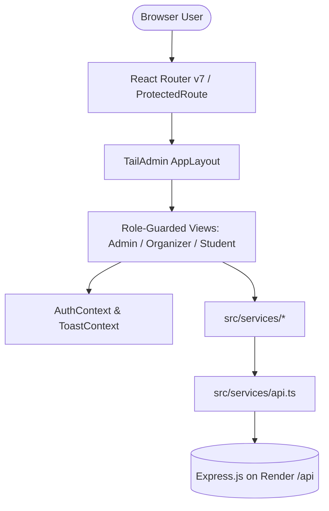
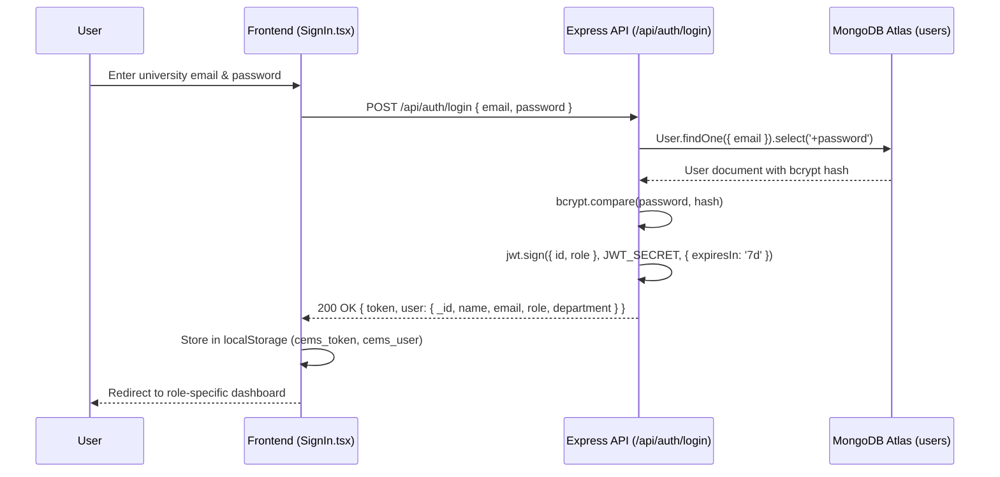
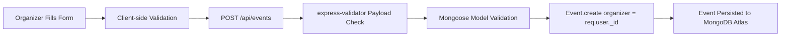
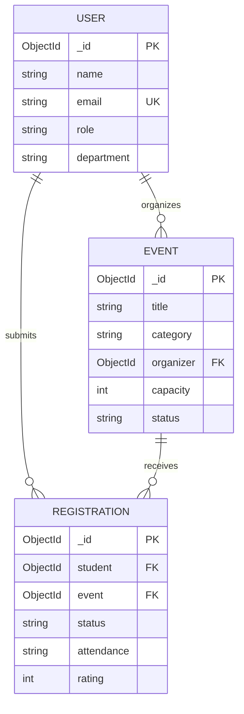
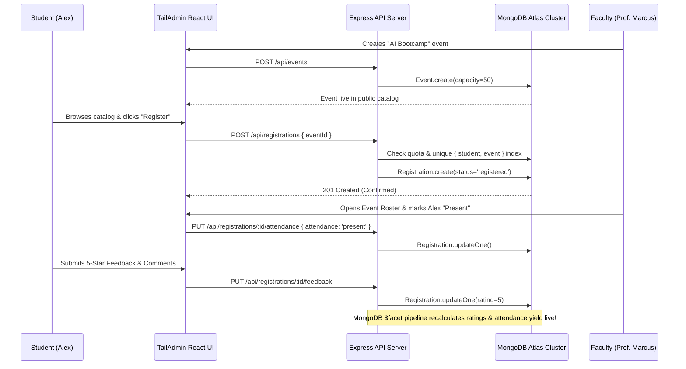

# 🎓 College Event Management System (CEMS)

> **Enterprise-Grade Academic Event Governance, Analytics & MongoDB Aggregation Platform**  
> Built as an advanced capstone implementation for **Advanced Database Management Systems (ADBMS)** and **Modern Web Engineering**.  
> Engineered with a **TailAdmin React + TypeScript + Tailwind CSS** frontend deployed on **GitHub Pages**, paired with a modular **Node.js + Express.js + Mongoose 8** backend hosted on **Render**, backed by a cloud-hosted **MongoDB Atlas** cluster.

---

## 📑 Table of Contents

1. [Project Overview](#1-project-overview)
2. [Objectives](#2-objectives)
3. [Complete Technology Stack](#3-complete-technology-stack)
4. [Why Each Technology Is Used](#4-why-each-technology-is-used)
5. [Frontend Architecture](#5-frontend-architecture)
6. [Backend Architecture](#6-backend-architecture)
7. [Database Architecture](#7-database-architecture)
8. [All User Roles](#8-all-user-roles)
9. [Authentication Flow](#9-authentication-flow)
10. [Authorization Flow](#10-authorization-flow)
11. [Folder Structure](#11-folder-structure)
12. [API Architecture](#12-api-architecture)
13. [Important API Endpoints](#13-important-api-endpoints)
14. [Event Creation Process](#14-event-creation-process)
15. [Event Registration Process](#15-event-registration-process)
16. [Registration Cancellation Process](#16-registration-cancellation-process)
17. [Attendance Process](#17-attendance-process)
18. [Feedback Process](#18-feedback-process)
19. [MongoDB Collections](#19-mongodb-collections)
20. [MongoDB Schemas](#20-mongodb-schemas)
21. [Relationships](#21-relationships)
22. [ObjectId References](#22-objectid-references)
23. [Mongoose ODM](#23-mongoose-odm)
24. [Populate Operations](#24-populate-operations)
25. [Database Indexes](#25-database-indexes)
26. [Compound Indexes](#26-compound-indexes)
27. [Aggregation Pipelines](#27-aggregation-pipelines)
28. [Pipeline Stage: $match](#28-pipeline-stage-match)
29. [Pipeline Stage: $group](#29-pipeline-stage-group)
30. [Pipeline Stage: $sort](#30-pipeline-stage-sort)
31. [Pipeline Stage: $lookup](#31-pipeline-stage-lookup)
32. [Pipeline Stage: $unwind](#32-pipeline-stage-unwind)
33. [Pipeline Stage: $project](#33-pipeline-stage-project)
34. [Pipeline Stage: $facet](#34-pipeline-stage-facet)
35. [Dashboard Analytics](#35-dashboard-analytics)
36. [Frontend Routing](#36-frontend-routing)
37. [React Components](#37-react-components)
38. [State & Context Management](#38-state--context-management)
39. [API Service Layer](#39-api-service-layer)
40. [Validation](#40-validation)
41. [Error Handling](#41-error-handling)
42. [Security Architecture](#42-security-architecture)
43. [Environment Variables](#43-environment-variables)
44. [GitHub Configuration](#44-github-configuration)
45. [GitHub Pages Deployment](#45-github-pages-deployment)
46. [Render Deployment](#46-render-deployment)
47. [MongoDB Atlas Cloud Setup](#47-mongodb-atlas-cloud-setup)
48. [Local Development Guide](#48-local-development-guide)
49. [Production Deployment Guide](#49-production-deployment-guide)
50. [Complete End-to-End Workflow](#50-complete-end-to-end-workflow)
51. [Testing Strategy](#51-testing-strategy)
52. [Known Limitations](#52-known-limitations)
53. [Maintenance Instructions](#53-maintenance-instructions)

---

## 1. Project Overview

The **College Event Management System (CEMS)** is a full-stack academic web platform designed to streamline, govern, and monitor co-curricular and extracurricular campus operations.

- **Simple Explanation:** CEMS acts like a unified campus hub where college students discover hackathons, technical workshops, cultural fests, and sports meets, sign up with one click, get attendance marked by faculty, and submit ratings. Faculty manage their participant lists and take attendance, while administrators oversee the entire university system through live charts.
- **Technical Explanation:** CEMS is a multi-tier client-server application implementing strict Role-Based Access Control (RBAC) across three distinct privilege tiers (`admin`, `organizer`, `student`). The presentation tier is a responsive Single Page Application (SPA) built with TailAdmin, React 18, and TypeScript. The application tier is a RESTful API built on Express.js and Node.js. The persistence tier is a MongoDB Atlas cloud database managed through Mongoose 8 ODM schemas, compound unique indexes, and multi-stage aggregation pipelines.

---

## 2. Objectives

The system was engineered to fulfill academic criteria in advanced database management and web engineering:
1. **Automate Campus Event Lifecycle:** Eliminate paper-based event registrations, spreadsheets, and manual attendance lists.
2. **Enforce Referential & Concurrency Integrity:** Guarantee that events never exceed seating capacity and students cannot submit duplicate registrations even under simultaneous clicks.
3. **Preserve Registration History:** Implement state transitions (`registered` $\leftrightarrow$ `cancelled`) using soft status updates rather than hard document deletions.
4. **Demonstrate Production MongoDB Pipelines:** Replace in-memory JavaScript computations with database-level `$match`, `$group`, `$lookup`, `$unwind`, `$project`, and `$facet` aggregation pipelines.
5. **Support Dual Presentation Modes:** Provide both a live cloud-connected mode (Render + MongoDB Atlas) and an offline mock demonstration mode (`localStorage`) for reliable viva evaluations.

---

## 3. Complete Technology Stack

| Layer | Technologies |
| :--- | :--- |
| **Frontend UI & Presentation** | React 18.3.1, TypeScript 5.7.2, Vite 6.1.0, Tailwind CSS 3.4.17, TailAdmin UI |
| **Routing & Navigation** | React Router 7.1.5 (with HTML5 history and base URL support) |
| **Data Visualization** | ApexCharts 4.1.0, React-ApexCharts 1.7.0 |
| **HTTP & API Client** | Axios 1.20.0 (with request/response interceptors) |
| **Backend Runtime & Framework** | Node.js (ES Modules), Express.js 4.21.2 |
| **Database & ODM** | MongoDB Atlas, Mongoose 8.9.5 |
| **Security & Utilities** | JSON Web Tokens (`jsonwebtoken` 9.0.2), `bcryptjs` 2.4.3, `helmet` 8.0.0, `cors` 2.8.5, `morgan` 1.10.0 |
| **Input Validation** | `express-validator` 7.2.1 |
| **Hosting & CI/CD** | Frontend: GitHub Pages (via GitHub Actions) • Backend: Render (Web Service) |

---

## 4. Why Each Technology Is Used

- **React 18**: Provides a declarative component model that updates only modified DOM subtrees, ideal for live dashboard updates and stateful event listings.
- **TypeScript**: Catches type mismatches at compile time across API responses, model interfaces, and route parameters, preventing runtime `undefined` exceptions.
- **Vite 6**: Offers instantaneous Hot Module Replacement (HMR) and optimized Rollup tree-shaking for minimal production asset bundles.
- **Tailwind CSS & TailAdmin**: Delivers a consistent, enterprise-grade design system with dark/light mode switching and mobile-responsive grid layouts without bloat.
- **ApexCharts**: Generates hardware-accelerated SVG and canvas charts for registration trends, departmental yields, and satisfaction gauges.
- **Node.js & Express.js**: Handles high-concurrency asynchronous I/O with non-blocking event loops, well-suited for simultaneous student registrations.
- **MongoDB Atlas & Mongoose 8**: Document model allows flexible event metadata and nested structures while Mongoose provides strict schema enforcement, virtual population, and aggregation pipeline builders.
- **JWT & BcryptJS**: Stateless token-based authentication eliminates server-side session memory overhead, while 10-round salted bcrypt hashes protect passwords.

---

## 5. Frontend Architecture



- **Simple Explanation:** The frontend acts like a smart dashboard. When a user clicks a link, React Router swaps the screen without reloading the page. It checks who you are (Student, Faculty, or Admin) and shows only the buttons and pages you are permitted to see.
- **Technical Explanation:** The frontend is organized as a modular Single Page Application. Root entry point `main.tsx` wraps the tree with `AuthProvider` and `ToastProvider`. `App.tsx` configures a `<Router basename={import.meta.env.BASE_URL}>` to guarantee deep linking on GitHub Pages. Routes are split into public, protected (`<ProtectedRoute />`), and role-guarded (`<RoleProtectedRoute allowedRoles={[...]} />`).

---

## 6. Backend Architecture

- **Simple Explanation:** The backend is the central brain running in the cloud. It listens for requests from the frontend, verifies user identity, validates data (e.g., checking if an event is already full), queries MongoDB, and sends back clean JSON responses.
- **Technical Explanation:** Structured as a layered 3-tier REST architecture:
  1. **Route Layer (`backend/routes/`)**: Maps HTTP verbs and paths to middleware and controllers.
  2. **Controller Layer (`backend/controllers/`)**: Extracts request parameters, manages HTTP status codes, and delegates work to services.
  3. **Service Layer (`backend/services/`)**: Implements transaction rules, capacity checks, and executes Mongoose queries and aggregation pipelines.
  4. **Middleware Layer (`backend/middleware/`)**: Handles JWT extraction (`authMiddleware.js`), RBAC verification (`roleMiddleware.js`), and centralized error formatting (`errorMiddleware.js`).

---

## 7. Database Architecture

CEMS uses a document-oriented model centered on three collections:
- `users`: Contains academic identities, password hashes, departments, and role flags.
- `events`: Contains event logistics, quotas, categories, schedules, and organizer references.
- `registrations`: Bridge collection connecting students to events, tracking lifecycle state (`registered`/`cancelled`), attendance status (`pending`/`present`/`absent`), and post-event star reviews.

Referential integrity is maintained through Mongoose `ObjectId` references (`ref: 'User'`, `ref: 'Event'`). Unique compound indexing on `{ student: 1, event: 1 }` guarantees zero duplicate registrations at the database level.

---

## 8. All User Roles

| Role | Access Scope | Key Capabilities |
| :--- | :--- | :--- |
| 👑 **Admin** | System-wide global access | Institutional dashboard, student/organizer account activation, global event and registration oversight, full ADBMS Database Insights pipeline inspector. |
| 📋 **Organizer** (Faculty) | Event management scope | Create/edit events, monitor participant rosters, mark live attendance (`present`/`absent`), inspect student star ratings and feedback. |
| 🎒 **Student** | Self-service scope | Browse and filter events, 1-click RSVP and cancellation, view registered events, view personalized attendance records, submit 1–5 star reviews. |

---

## 9. Authentication Flow



- **Simple Explanation:** When you log in with your email and password, the server checks whether your password matches its encrypted database record. If correct, the server hands your browser a secure digital badge (a JWT token) which your browser attaches to every future request.
- **Technical Explanation:** Authentication is stateless via JSON Web Tokens. Passwords are never stored in plaintext; Mongoose hashes passwords with a 10-round bcrypt salt in a `pre('save')` hook. The `password` field has `select: false` by default so accidental queries never expose password hashes. On successful authentication, a signed JWT containing `{ id, role }` is returned.

---

## 10. Authorization Flow

1. Every incoming authenticated HTTP request passes through `protect` in `backend/middleware/authMiddleware.js`.
2. The middleware extracts the `Bearer <token>` from the HTTP `Authorization` header.
3. `jwt.verify()` validates the token signature and expiration against `JWT_SECRET`.
4. The decoded user ID is looked up in MongoDB and attached to `req.user`.
5. Role authorization middleware `authorize('admin', 'organizer')` checks if `req.user.role` is included in the allowed roles. If not, it halts execution immediately with `403 Forbidden`.

---

## 11. Folder Structure

```text
Adbms/
├── .github/
│   └── workflows/
│       └── deploy-pages.yml       # Automated GitHub Pages CI/CD workflow
├── backend/
│   ├── config/
│   │   └── db.js                  # MongoDB Atlas Mongoose connection & health status
│   ├── controllers/               # Express request handlers (auth, event, user, etc.)
│   ├── middleware/                # JWT protect, RBAC authorize, errorMiddleware
│   ├── models/                    # User.js, Event.js, Registration.js (Schemas & Indexes)
│   ├── routes/                    # API route definitions
│   ├── scripts/                   # Database seed scripts
│   ├── services/                  # Business logic & 9 MongoDB Aggregation Pipelines
│   ├── validators/                # express-validator schemas
│   ├── .env.example               # Backend environment variable template
│   ├── package.json               # Backend dependencies & scripts
│   └── server.js                  # Express server entry point & CORS configuration
├── src/
│   ├── components/                # TailAdmin UI components (tables, inputs, buttons)
│   ├── context/                   # AuthContext, ToastContext, SidebarContext, ThemeContext
│   ├── data/mock/                 # Realistic fallback mock data for offline demo
│   ├── layout/                    # AppLayout, AppSidebar, AppHeader, Backdrop
│   ├── pages/
│   │   ├── admin/                 # AdminDashboard, DatabaseInsights, Students, Organizers, etc.
│   │   ├── organizer/             # OrganizerDashboard, CreateEvent, Participants, Analytics, etc.
│   │   ├── student/               # StudentDashboard, Events, EventDetails, Attendance, etc.
│   │   ├── public/                # LandingPage (Discover. Register. Participate.)
│   │   ├── AuthPages/             # SignIn, SignUp, ForgotPassword, ResetPassword
│   │   └── common/                # ProfilePage, SettingsPage
│   ├── routes/                    # ProtectedRoute.tsx & RoleProtectedRoute.tsx
│   ├── services/                  # API client (api.ts) & frontend service modules
│   ├── types/                     # TypeScript type definitions and data contracts
│   ├── App.tsx                    # Route tree configuration with basename
│   └── main.tsx                   # React root entry point
├── render.yaml                    # Render Web Service blueprint configuration
├── vite.config.ts                 # Vite bundler configuration with dynamic base path
├── package.json                   # Frontend dependencies & npm scripts
└── README.md                      # Comprehensive project documentation
```

---

## 12. API Architecture

The backend REST API adheres to standard HTTP status codes and uniform JSON response envelopes:

```json
{
  "success": true,
  "message": "Operation description",
  "data": { ... }
}
```

On validation or business errors:
```json
{
  "success": false,
  "message": "Human-readable error explanation",
  "errors": [ ... ]
}
```

Axios in `src/services/api.ts` intercepts all outgoing requests to inject the `Authorization: Bearer <token>` header, and intercepts incoming responses to automatically catch 401 Unauthorized errors and redirect expired sessions to `/signin`.

---

## 13. Important API Endpoints

### Authentication & Users
- `POST /api/auth/register` - Public student self-registration
- `POST /api/auth/login` - Authenticate user & return JWT token
- `GET /api/auth/me` - Retrieve authenticated user profile
- `GET /api/users` - Admin: List users with pagination and search
- `PUT /api/users/:id` - Admin/Self: Update profile or active state
- `DELETE /api/users/:id` - Admin: Remove user account

### Events
- `GET /api/events` - Public/Authenticated: List events (search, filter, pagination)
- `GET /api/events/:id` - Fetch single event with seats remaining calculation
- `POST /api/events` - Organizer/Admin: Publish new event
- `PUT /api/events/:id` - Organizer/Admin: Update event logistics
- `PATCH /api/events/:id/cancel` - Organizer/Admin: Mark event status as cancelled
- `DELETE /api/events/:id` - Organizer/Admin: Remove event and associated registrations

### Registrations, Attendance & Feedback
- `POST /api/registrations` - Student/Admin: Register for an event
- `GET /api/registrations/my` - Student: Fetch personal registration history
- `DELETE /api/registrations/:id` - Student/Admin: Cancel registration (soft-cancel)
- `GET /api/registrations/event/:eventId/participants` - Organizer/Admin: View event roster
- `GET /api/registrations` - Admin: System-wide registration listing
- `PUT /api/registrations/:id/attendance` - Organizer/Admin: Update attendance (`present`/`absent`)
- `PUT /api/registrations/:id/feedback` - Student: Submit rating (1–5) and review

### Analytics & ADBMS Insights
- `GET /api/analytics/admin` - Admin: Multi-stage aggregated institutional metrics
- `GET /api/analytics/organizer` - Organizer: Aggregated metrics for hosted events
- `GET /api/analytics/database-insights` - Admin: Live collection counts and aggregation stages

---

## 14. Event Creation Process



1. Faculty organizer fills title, category, date, time, venue, capacity, deadline, and banner image.
2. `eventValidators.js` verifies that capacity is a positive integer, date is formatted properly, and category belongs to the allowed enum.
3. Controller assigns `organizer: req.user._id` from the verified JWT.
4. Document is saved in the `events` collection with initial status `upcoming`.

---

## 15. Event Registration Process

The registration workflow includes 6 sequential integrity checks before enrollment:
1. **Event Existence**: Verifies the target event exists.
2. **Lifecycle Status**: Rejects registration if status is `cancelled` or `completed`.
3. **Registration Deadline**: Rejects registration if `now > registrationDeadline`.
4. **Capacity Enforcement**: Counts active registrations via `Registration.countDocuments({ event: eventId, status: 'registered' })`. Rejects if active registrations $\ge$ `capacity`.
5. **Duplicate Prevention**: Checks `Registration.findOne({ student: studentId, event: eventId })`. Rejects if already registered.
6. **State Reactivation**: If a previous soft-cancelled document exists, it updates status back to `registered` and timestamps `registeredAt` to now, preserving document history without violating unique compound indexes.

---

## 16. Registration Cancellation Process

- **Simple Explanation:** Students can change their mind and cancel their registration. Instead of deleting the record from the database, the system marks it as "cancelled" so the seat is freed up for someone else, while the college keeps an audit history.
- **Technical Explanation:** Handled in `registrationService.cancelRegistration`. Verifies that the requester is the student owner or an admin. Sets `registration.status = 'cancelled'`. Soft-cancellation retains participation logs and preserves the unique index constraint without data loss.

---

## 17. Attendance Process

- Faculty organizers open the **Participant Roster** page (`/organizer/participants`).
- The organizer views all registered students for the selected event.
- Clicking **Mark Present** or **Mark Absent** dispatches `PUT /api/registrations/:id/attendance` with `{ attendance: 'present' | 'absent' }`.
- Backend verifies organizer ownership of the event before saving.
- The UI reflects the badge change instantly, and dashboard attendance rates recalculate automatically.

---

## 18. Feedback Process

- Students can submit star ratings and feedback comments only for events that are **completed** and where their attendance was marked **present**.
- Duplicate reviews are blocked: `registrationService.submitFeedback` checks `if (registration.rating) throw Error('Feedback already submitted')`.
- Rating must be an integer between 1 and 5.
- Submitted ratings feed into the MongoDB `$facet` aggregation to compute institutional and organizer average scores.

---

## 19. MongoDB Collections

The database contains three principal collections:
- `users`: Stores user identity documents.
- `events`: Stores campus event documents.
- `registrations`: Stores join documents linking users to events.

---

## 20. MongoDB Schemas

### User Schema (`backend/models/User.js`)
```javascript
{
  name: { type: String, required: true, trim: true, maxlength: 100 },
  email: { type: String, required: true, unique: true, lowercase: true, trim: true },
  password: { type: String, required: true, minlength: 6, select: false },
  role: { type: String, enum: ['admin', 'organizer', 'student'], default: 'student' },
  phone: { type: String, default: '' },
  department: { type: String, enum: ['Computer Science', 'Information Technology', 'AI & Data Science', 'Electronics', 'Mechanical', 'Civil', 'MBA', 'General'], default: 'Computer Science' },
  avatar: { type: String, default: '' },
  isActive: { type: Boolean, default: true }
}
```

### Event Schema (`backend/models/Event.js`)
```javascript
{
  title: { type: String, required: true, trim: true, maxlength: 150 },
  description: { type: String, required: true },
  category: { type: String, required: true, enum: ['Technical', 'Cultural', 'Sports', 'Workshop', 'Seminar', 'Competition', 'Other'] },
  date: { type: Date, required: true },
  time: { type: String, required: true },
  venue: { type: String, required: true },
  organizer: { type: mongoose.Schema.Types.ObjectId, ref: 'User', required: true },
  capacity: { type: Number, required: true, min: 1 },
  status: { type: String, enum: ['upcoming', 'ongoing', 'completed', 'cancelled'], default: 'upcoming' },
  image: { type: String, default: '' },
  registrationDeadline: { type: Date, required: true }
}
```

### Registration Schema (`backend/models/Registration.js`)
```javascript
{
  student: { type: mongoose.Schema.Types.ObjectId, ref: 'User', required: true },
  event: { type: mongoose.Schema.Types.ObjectId, ref: 'Event', required: true },
  status: { type: String, enum: ['registered', 'cancelled'], default: 'registered' },
  attendance: { type: String, enum: ['pending', 'present', 'absent'], default: 'pending' },
  feedback: { type: String, default: '' },
  rating: { type: Number, min: 1, max: 5, default: null },
  registeredAt: { type: Date, default: Date.now }
}
```

---

## 21. Relationships



- **User to Event**: One-to-Many (`organizer` field in `Event` references `User._id`).
- **User to Registration**: One-to-Many (`student` field in `Registration` references `User._id`).
- **Event to Registration**: One-to-Many (`event` field in `Registration` references `Event._id`).

---

## 22. ObjectId References

MongoDB `ObjectId` is a 12-byte BSON identifier composed of a 4-byte timestamp, 5-byte random value, and 3-byte incrementing counter. In CEMS, documents maintain normalized references via `mongoose.Schema.Types.ObjectId` rather than deeply nesting child arrays. This prevents document size bloat (avoiding MongoDB's 16MB document limit) and ensures consistency when user profiles or event details are modified.

---

## 23. Mongoose ODM

Mongoose serves as the Object-Document Mapper (ODM) providing:
- **Type casting**: Automatically casts strings to `ObjectId` or dates to `Date`.
- **Pre-save hooks**: Automatically runs bcrypt password hashing before user writes.
- **JSON transforms**: Strips `password` from the JSON representation of user documents.
- **Virtuals**: Declares virtual population on `Event` to count registrations dynamically.

---

## 24. Populate Operations

- **Simple Explanation:** In relational databases like MySQL, you use SQL `JOIN` to bring user data together with event data. In MongoDB, Mongoose `populate()` performs this by automatically fetching the linked documents.
- **Technical Explanation:** Mongoose `.populate()` executes secondary lookup queries and replaces ObjectId reference fields with the resolved documents. For example, in `eventService.js`:
  ```javascript
  Event.find(filter).populate('organizer', 'name email department avatar');
  ```
  And multi-level population in `registrationService.js`:
  ```javascript
  Registration.find({ student: studentId })
    .populate({
      path: 'event',
      populate: { path: 'organizer', select: 'name email department' }
    });
  ```

---

## 25. Database Indexes

Indexes speed up read queries from $O(N)$ collection scans to $O(\log N)$ B-tree index seeks. CEMS defines single-field and multi-field indexes:

### User Collection
- `userSchema.index({ role: 1 })` - Speeds up role-based queries.
- `userSchema.index({ department: 1 })` - Optimizes department filtering.
- `userSchema.index({ role: 1, department: 1 })` - Optimizes combined role + department filtering.

### Event Collection
- `eventSchema.index({ date: 1 })` - Speeds up chronological sorting.
- `eventSchema.index({ category: 1 })` - Optimizes category filtering.
- `eventSchema.index({ status: 1 })` - Optimizes status filtering.
- `eventSchema.index({ organizer: 1 })` - Optimizes organizer dashboard queries.
- `eventSchema.index({ status: 1, date: 1 })` - Optimizes upcoming events query.
- `eventSchema.index({ title: 'text', description: 'text' })` - Full-text search index.

---

## 26. Compound Indexes

The most critical database constraint in CEMS is defined in `backend/models/Registration.js`:

```javascript
registrationSchema.index({ student: 1, event: 1 }, { unique: true });
```

- **ADBMS Purpose:** Enforces that a student can have at most **one** registration document per event at the database engine level.
- **Concurrency Protection:** Even if two identical HTTP registration requests arrive at the exact same millisecond, MongoDB's unique compound index rejects the second write with a duplicate key error (`E11000`), guaranteeing data integrity without distributed locks.

---

## 27. Aggregation Pipelines

An aggregation pipeline processes documents through an assembly line of stages. Documents from a collection pass through sequential operators that filter, group, join, reshape, and calculate metrics.

CEMS implements **9 production-grade aggregation pipelines** in `backend/services/analyticsService.js`.

---

## 28. Pipeline Stage: $match

Filters documents so only those matching specific criteria proceed to the next stage:
```javascript
{ $match: { status: 'registered' } }
```
Used in attendance, department, and registration volume aggregations to exclude soft-cancelled records.

---

## 29. Pipeline Stage: $group

Groups input documents by a specified identifier expression and applies accumulator operators:
```javascript
{
  $group: {
    _id: '$category',
    count: { $sum: 1 },
    totalCapacity: { $sum: '$capacity' }
  }
}
```
Accumulator operators used in CEMS:
- `$sum: 1`: Counts occurrences.
- `$sum: '$capacity'`: Sums numerical capacity.
- `$avg: '$rating'`: Calculates arithmetic mean review score.
- `$cond`: Computes conditional sums (e.g., counting present students only).

---

## 30. Pipeline Stage: $sort

Orders documents by specified fields in ascending (`1`) or descending (`-1`) order:
```javascript
{ $sort: { registrationCount: -1 } }
```
Ensures top-performing events or departments appear first in analytics tables.

---

## 31. Pipeline Stage: $lookup

Performs an equality join to another collection in the same database:
```javascript
{
  $lookup: {
    from: 'events',
    localField: '_id',
    foreignField: '_id',
    as: 'eventDetails'
  }
}
```
Joins registration group keys with the `events` collection to retrieve event titles, categories, and capacities.

---

## 32. Pipeline Stage: $unwind

Deconstructs an array field from the input document to output a document for each element:
```javascript
{ $unwind: '$eventDetails' }
```
Because `$lookup` always outputs an array (even for 1-to-1 matches), `$unwind` flattens the single-item array into a direct object property so its subfields (`$eventDetails.title`) can be accessed without array indexing.

---

## 33. Pipeline Stage: $project

Reshapes documents by including, excluding, renaming, or computing new derived fields:
```javascript
{
  $project: {
    _id: 0,
    department: '$_id',
    totalRegistrations: 1,
    attendanceRate: {
      $round: [
        { $multiply: [{ $divide: ['$presentCount', '$totalRegistrations'] }, 100] },
        1
      ]
    }
  }
}
```
Calculates attendance percentages using `$divide`, `$multiply`, and `$round`.

---

## 34. Pipeline Stage: $facet

Executes multiple aggregation pipelines within a single stage on the same input documents.
Used in `getAdminDashboardSummary()` in `backend/services/analyticsService.js`:

```javascript
Registration.aggregate([
  {
    $facet: {
      attendanceBreakdown: [
        { $match: { status: 'registered' } },
        { $group: { _id: '$attendance', count: { $sum: 1 } } }
      ],
      averageRating: [
        { $match: { rating: { $ne: null } } },
        { $group: { _id: null, avg: { $avg: '$rating' }, totalReviews: { $sum: 1 } } }
      ]
    }
  }
])
```
- **Performance Benefit:** Computes both the attendance distribution and average satisfaction rating in a **single database pass**, cutting network round-trips in half.

---

## 35. Dashboard Analytics

- **Admin Dashboard (`/admin/dashboard`)**: Displays institutional KPIs (total students, organizers, events, registrations, attendance yield, average satisfaction rating), monthly registration trend area chart, department turnout horizontal bar chart, and event category distribution donut chart.
- **Organizer Dashboard (`/organizer/dashboard`)**: Displays total hosted sessions, active RSVPs, capacity utilization, dynamic bar charts of registrations by event, and quick participant roster actions.
- **Student Dashboard (`/student/dashboard`)**: Displays personalized enrolled sessions, attended events count, pending feedback alerts, dynamic monthly participation bars, and upcoming event recommendations.

---

## 36. Frontend Routing

React Router v7 routes configured in `src/App.tsx`:
- Public: `/`, `/signin`, `/login`, `/signup`, `/register`, `/forgot-password`, `/reset-password`
- Protected Common: `/profile`, `/settings`
- Protected Student: `/student/dashboard`, `/student/events`, `/student/events/:id`, `/student/registrations`, `/student/attendance`, `/student/feedback`
- Protected Organizer: `/organizer/dashboard`, `/organizer/events`, `/organizer/events/create`, `/organizer/events/:id/edit`, `/organizer/participants`, `/organizer/attendance`, `/organizer/feedback`, `/organizer/analytics`
- Protected Admin: `/admin/dashboard`, `/admin/students`, `/admin/organizers`, `/admin/events`, `/admin/registrations`, `/admin/attendance`, `/admin/analytics`, `/admin/database-insights`
- Fallback: `/unauthorized`, `*` (404 Not Found)

---

## 37. React Components

- **Layout Components**: `AppLayout`, `AppHeader`, `AppSidebar`, `SidebarWidget` (with demo role switcher), `Backdrop`.
- **UI Element Library**: Buttons, Badges, Modals, Dropdowns, Cards, Form Inputs (`InputField`, `Checkbox`, `Label`), Alert notifications.
- **Interactive Visualizations**: ApexCharts wrappers for Donut, Area, and Bar charts.
- **ADBMS Explorer**: `AdminDatabaseInsights.tsx` featuring live stage-by-stage pipeline visualization, pipeline explanations, and academic viva Q&A cards.

---

## 38. State & Context Management

1. **`AuthContext.tsx`**: Manages current user session (`currentUser`, `token`, `role`, `isAuthenticated`, `isLoading`), handles login, registration, logout, profile updates, and 1-click viva demo role switching.
2. **`ToastContext.tsx`**: Provides global non-blocking toast notifications (`showToast(message, 'success' | 'error' | 'info' | 'warning')`).
3. **`SidebarContext.tsx`**: Controls mobile sidebar expansion and desktop collapse states.
4. **`ThemeContext.tsx`**: Manages light and dark theme toggling, persisting preferences to HTML class attributes.

---

## 39. API Service Layer

Frontend services isolate network communication from UI rendering:
- `src/services/api.ts`: Central Axios instance with base URL resolution, timeout configuration (30,000ms), authorization header injection, and 401 token expiration handling.
- `src/services/authService.ts`: Login, registration, profile retrieval, and demo role switching.
- `src/services/eventService.ts`: CRUD operations and filtered listing for events.
- `src/services/registrationService.ts`: Event RSVP, cancellation, attendance updates, participant rosters, and feedback submission.
- `src/services/analyticsService.ts`: Institutional summaries, organizer telemetry, student metrics, and database insight records.
- `src/services/userService.ts`: User management, status toggling, and role governance.

---

## 40. Validation

- **Client-Side Validation**: HTML5 form constraints, password length checks ($\ge 6$ characters), confirmation matching, and required field indicators.
- **Server-Side Validation**: `express-validator` middleware rules:
  - `authValidators.js`: Email format verification, name string trimming, password length enforcement.
  - `eventValidators.js`: Capacity positive integer validation, category enum verification, ISO date parsing.
  - `registrationValidators.js`: Attendance enum (`pending`/`present`/`absent`) and rating bounds (1 to 5).

---

## 41. Error Handling

- **Database-Level**: Unique compound index violations catch code `11000` and translate them into readable messages (`"Duplicate registration detected"`).
- **Express Middleware**: `errorMiddleware.js` provides centralized error catching:
  - Catches 404 for undefined routes.
  - Formats unhandled exceptions into `{ success: false, message: ... }`.
  - Hides internal stack traces in production (`NODE_ENV === 'production'`).
- **Axios Interceptors**: Extracts backend error messages and falls back to network failure notices, passed directly to toast notifications.

---

## 42. Security Architecture

1. **Password Hashing**: 10-round salted bcrypt hashes protect passwords against rainbow table attacks.
2. **JWT Route Guarding**: All operational endpoints require cryptographic token verification.
3. **HTTP Header Hardening**: Helmet (`helmet({ crossOriginResourcePolicy: false })`) sets HTTP security headers (XSS filter, frameguard, noSniff).
4. **CORS Governance**: Configured in `server.js` with whitelist matching for GitHub Pages, Render, and local development origins.
5. **No Password Leakage**: `select: false` on Mongoose schema and explicit `delete ret.password` in `toJSON` transforms.

---

## 43. Environment Variables

### Frontend (`.env` in Root)
```env
VITE_API_URL=https://college-event-management-system-1qmx.onrender.com/api
VITE_USE_MOCK_DATA=false
```

### Backend (`backend/.env`)
```env
PORT=5000
NODE_ENV=development
MONGO_URI=mongodb+srv://<username>:<password>@cluster0.xxxxx.mongodb.net/college_event_management?retryWrites=true&w=majority
JWT_SECRET=cems_super_secure_academic_jwt_secret_2026
CLIENT_URL=https://atharva1811.github.io/college-event-management-system
```

---

## 44. GitHub Configuration

- **Repository**: `Atharva1811/college-event-management-system`
- **Branch**: `main`
- **Git Tracking**: Clean working tree with `.gitignore` properly excluding `.env`, build artifacts (`dist/`), and all `node_modules`.

---

## 45. GitHub Pages Deployment

The frontend is deployed to GitHub Pages at:  
`https://atharva1811.github.io/college-event-management-system/`

- **GitHub Actions Workflow (`.github/workflows/deploy-pages.yml`)**:
  - Automatically triggers on push to `main` or manual `workflow_dispatch`.
  - Sets `GITHUB_PAGES: 'true'` so `vite.config.ts` computes `base: '/college-event-management-system/'`.
  - Injects `VITE_API_URL` pointing to the live Render backend.
  - Copies `dist/index.html` to `dist/404.html` so that deep links and page refreshes work seamlessly under client-side React Router on GitHub Pages.

---

## 46. Render Deployment

The backend API is deployed as a Web Service on Render:  
`https://college-event-management-system-1qmx.onrender.com`

- **Blueprint Configuration (`render.yaml`)**:
  - Root directory: `backend`
  - Build command: `npm install`
  - Start command: `npm start`
  - Health check path: `/api/health`
  - Environment variables: `NODE_ENV`, `PORT=10000`, `MONGO_URI`, `JWT_SECRET`, `CLIENT_URL`.

---

## 47. MongoDB Atlas Cloud Setup

1. Create a MongoDB Atlas cluster (M0 Free tier or dedicated).
2. Under **Network Access**, allow access from `0.0.0.0/0` (required for Render dynamic IP hosting).
3. Under **Database Access**, create a user with read/write privileges.
4. Copy the connection URI into `backend/.env` and Render's environment settings.

---

## 48. Local Development Guide

### Prerequisites
- Node.js 18+ and npm installed.
- (Optional) MongoDB local instance or MongoDB Atlas account.

### 1. Run Frontend in Mock Mode (Zero Setup)
```bash
# In project root:
npm install
npm run dev
```
Open [http://localhost:5173](http://localhost:5173). Mock mode is ready for presentation with full interactive state stored in `localStorage`.

### 2. Run with Full Local Backend
```bash
# In backend directory:
cd backend
npm install
npm run dev

# In another terminal (project root):
npm run dev
```

---

## 49. Production Deployment Guide

### Deploy Frontend
Push changes to the `main` branch on GitHub:
```bash
git push origin main
```
GitHub Actions builds the production bundle and deploys to GitHub Pages automatically.

### Deploy Backend
Push changes to the repository. If Render auto-deploy is enabled, Render pulls the commit, runs `npm install`, and restarts the server with zero downtime.

---

## 50. Complete End-to-End Workflow



---

## 51. Testing Strategy

1. **Static Type Checking**: `npx tsc -b` validates TypeScript types across all components, hooks, and services.
2. **ESLint Linting**: `npm run lint` audits React hooks dependency rules and code conventions.
3. **Production Compilation**: `npm run build` verifies Rollup chunking, minification, and CSS extraction.
4. **Backend Syntax Verification**: `node --check` validates syntax on all controller, model, route, and service files.
5. **Database Safety Rule**: Production database data is treated as strictly **READ-ONLY** during all testing procedures; automated writes to production MongoDB are prohibited.

---

## 52. Known Limitations

- **Render Free Tier Spin-Down**: Render's free tier spins down web services after 15 minutes of inactivity. The initial cold request may take 20–45 seconds to wake up (Axios timeout is set to 30,000ms to tolerate cold starts).
- **Client-Side GitHub Pages Routing**: Requires the `404.html` fallback trick because GitHub Pages is a static file server without native URL rewriting.
- **File Upload Storage**: Event banner images currently use URL references rather than direct binary multi-part S3/Cloudinary storage.

---

## 53. Maintenance Instructions

1. **Rotating JWT Secrets**: Change `JWT_SECRET` in Render environment settings. All active sessions will gracefully log out on their next request and require re-authentication.
2. **Adding New Departments**: Add the department string to the `Department` type union in `src/types/index.ts`, the department select options in `SignUpForm.tsx`, and the `department` enum in `backend/models/User.js`.
3. **Adding New Event Categories**: Update `EventCategory` in `src/types/index.ts` and the `category` enum in `backend/models/Event.js`.
4. **Database Backups**: In MongoDB Atlas, configure automated daily snapshot backups under Cloud Backup settings.

---

## ⚖️ Academic Integrity & Coursework Notice

Developed as a capstone project for **Advanced Database Management Systems (ADBMS)** and **Modern Web Engineering**. Built using the TailAdmin open-source template. All database schemas, indexing strategies, and aggregation pipelines are engineered specifically for institutional event management.
