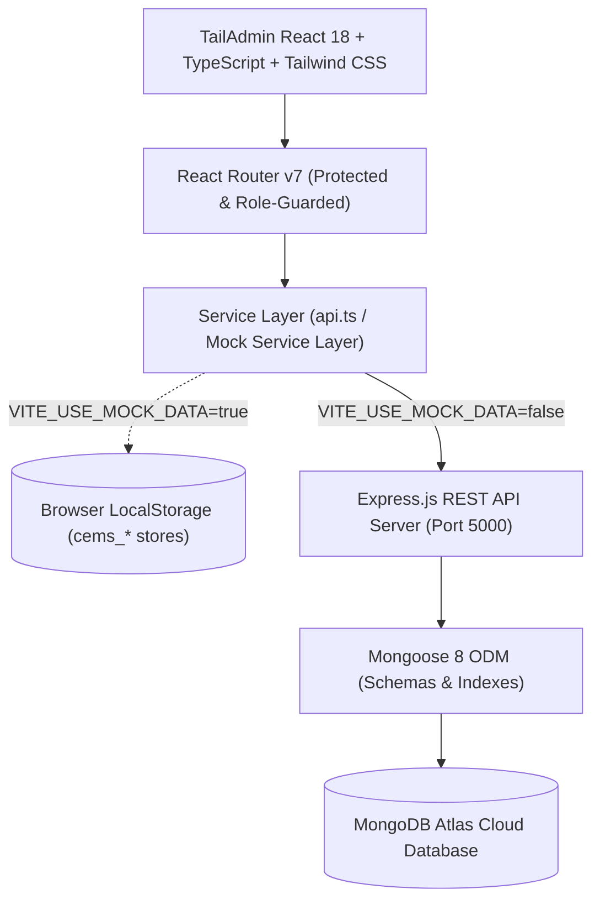

# 🎓 College Event Management System (CEMS)

> **Enterprise-Grade Academic Event Governance & Analytics Platform**  
> Built for dual demonstration in **Advanced Database Management Systems (ADBMS)** and **Modern Frontend Web Engineering**.  
> Implemented using **TailAdmin React + Tailwind CSS** frontend architecture with **Node.js, Express, MongoDB Atlas, and Mongoose ODM**.

---

## 🌟 Highlights & Key Capabilities

- **Zero-Setup Demonstration Ready**: Runs out-of-the-box in **Mock Data Mode** (`VITE_USE_MOCK_DATA=true`) without requiring database credentials or network access. Live state persists to `localStorage` during presentations!
- **3 Distinct Academic Roles**:
  - 👑 **Admin**: Global campus oversight, faculty coordinator approvals, system-wide registration analytics, and an interactive **MongoDB Aggregation Explorer**.
  - 📋 **Faculty Organizer**: Event creation/editing lifecycle, participant roster management, real-time attendance marking (`present`/`absent`), and feedback analytics.
  - 🎒 **Student**: Public event discovery, 1-click registration/cancellation with capacity enforcement, personalized QR attendance ticket, and post-event rating/reviews.
- **1-Click Role Switcher**: Quick-switch badge in the bottom-left sidebar allows immediate role switching between Admin, Organizer, and Student during viva evaluations.
- **Advanced ADBMS Aggregation Engine**:
  - Interactive pipeline stage-by-stage visualization at `/admin/database-insights`.
  - 9 production-grade MongoDB aggregation pipelines utilizing `$match`, `$lookup`, `$unwind`, `$group`, `$sort`, `$project`, `$facet`, and `$cond`.

---

## 🏗️ System Architecture



---

## 🛠️ Technology Stack

| Layer | Technology | Description |
| :--- | :--- | :--- |
| **Frontend Framework** | React 18, TypeScript, Vite | Fast, typed, modern component-driven UI |
| **Design System** | TailAdmin Community Edition + Tailwind CSS | Polished dark/light dashboard theme, responsive layouts |
| **Visualizations** | ApexCharts + react-apexcharts | Donut charts, area trend curves, department turnout bar charts |
| **Icons & Media** | Heroicons / SVG Icons, Unsplash CDN | Production-grade academic visual assets |
| **Backend API** | Node.js (ES Modules), Express.js 4 | Modular controllers, services, validators, and middlewares |
| **Database** | MongoDB Atlas, Mongoose 8 | Document database with compound indexes & aggregation pipelines |
| **Security & Auth** | JWT (JSON Web Tokens), bcryptjs, Helmet, CORS | Industry-standard password hashing and route authorization |

---

## 🚀 Quick Start (Mock Mode - No Database Required)

The project is preconfigured to run out of the box with zero external dependencies.

### 1. Install Dependencies
```bash
# In the project root:
npm install
```

### 2. Verify `.env` Configuration
The root `.env` is already configured for standalone demonstration:
```env
VITE_API_URL=http://localhost:5000/api
VITE_USE_MOCK_DATA=true
```

### 3. Launch Development Server
```bash
npm run dev
```
Open **[http://localhost:5173](http://localhost:5173)** in your browser.

---

## 👥 Demo Accounts & Role Switcher

You can log in directly using the demo buttons on the Sign In page, or switch roles at any time using the **Demo Role Switcher** widget pinned to the bottom of the sidebar.

| Role | Email | Password | Primary Capabilities |
| :--- | :--- | :--- | :--- |
| **Admin** | `admin@cems.edu` | `admin123` | System oversight, user approvals, MongoDB insights |
| **Organizer** | `sarah.faculty@cems.edu` | `org123` | Event publishing, participant rosters, attendance marking |
| **Student** | `alex.student@cems.edu` | `student123` | Event registration, QR attendance ticket, submitting ratings |

Additional student accounts: `priya.patel@cems.edu`, `marcus.vance@cems.edu`, `elena.rostova@cems.edu`.

---

## 🍃 MongoDB Atlas Backend Setup (When Ready)

When you are ready to connect a live MongoDB database:

### 1. Configure Backend Environment
Navigate to the `backend/` directory:
```bash
cd backend
cp .env.example .env
```
Edit `backend/.env` with your MongoDB connection string and JWT secret:
```env
PORT=5000
NODE_ENV=development
MONGO_URI=mongodb+srv://<username>:<password>@cluster0.xxxxx.mongodb.net/cems_db?retryWrites=true&w=majority
JWT_SECRET=cems_super_secure_academic_jwt_secret_2026
JWT_EXPIRES_IN=7d
CORS_ORIGIN=http://localhost:5173
```

### 2. Seed Initial Database
Populate the database with 1 Admin, 3 Faculty Organizers, 15 Students, 16 realistic Events, and 50+ Registrations:
```bash
npm run seed
```

### 3. Start Backend Server
```bash
npm run dev
# or: npm start
```
The backend health check endpoint will be available at:  
`http://localhost:5000/api/health`

### 4. Switch Frontend to Live API Mode
In the root `.env`:
```env
VITE_USE_MOCK_DATA=false
```
Restart `npm run dev` in the project root. The frontend will now communicate directly with your live Express + MongoDB backend!

---

## 📂 Project Directory Structure

```text
Adbms/
├── backend/                       # Node.js + Express + MongoDB backend
│   ├── config/                    # MongoDB Mongoose connection handler
│   ├── controllers/               # Auth, Event, Registration, Attendance, Feedback, Analytics
│   ├── middleware/                # JWT verification, Role authorization, Error handler
│   ├── models/                    # User.js, Event.js, Registration.js (Schemas & Indexes)
│   ├── routes/                    # Express REST endpoints
│   ├── scripts/                   # seed.js (Comprehensive demo dataset)
│   ├── services/                  # Business logic & 9 Aggregation Pipelines
│   ├── validators/                # express-validator payload schemas
│   ├── .env.example               # Backend environment template
│   ├── package.json               # Backend npm configuration
│   └── server.js                  # Express application entrypoint
│
├── src/                           # TailAdmin React Frontend Application
│   ├── components/                # TailAdmin UI library (buttons, tables, modals, cards)
│   ├── context/                   # AuthContext (Role switcher) & ToastContext
│   ├── data/mock/                 # Realistic fallback datasets for offline presentation
│   ├── layout/                    # AppLayout, AppSidebar, AppHeader, SidebarWidget
│   ├── pages/
│   │   ├── admin/                 # AdminDashboard, DatabaseInsights, Students, Organizers, etc.
│   │   ├── organizer/             # OrganizerDashboard, CreateEvent, Participants, Feedback, etc.
│   │   ├── student/               # StudentDashboard, EventBrowser, Registrations, Attendance, etc.
│   │   ├── public/                # LandingPage ("Discover. Register. Participate.")
│   │   ├── AuthPages/             # SignIn, SignUp, ForgotPassword, ResetPassword
│   │   └── common/                # ProfilePage, SettingsPage
│   ├── routes/                    # ProtectedRoute & RoleProtectedRoute guards
│   ├── services/                  # API client & localStorage offline mock service
│   ├── types/                     # TypeScript data contracts & models
│   ├── App.tsx                    # React Router configuration
│   └── main.tsx                   # Application entrypoint & providers
│
├── DATABASE_DOCUMENTATION.md      # Detailed ADBMS viva guide & schema reference
├── README.md                      # This project overview document
└── package.json                   # Frontend npm configuration
```

---

## ⚡ ADBMS Aggregation Pipelines Summary

The system demonstrates **9 distinct MongoDB Aggregation Pipelines**:

1. **Seating Capacity & Utilization**: `$match` -> `$group` -> `$lookup` -> `$unwind` -> `$project` (calculates `% capacity utilization`).
2. **Total Registration Volume**: `$match` -> `$group` -> `$lookup` -> `$unwind` -> `$project` -> `$sort`.
3. **Events by Category**: `$group` (`_id: "$category"`) -> `$sort`.
4. **Monthly Trend**: `$group` (extracts `$year` & `$month`) -> `$sort`.
5. **Departmental Participation & Attendance Yield**: `$match` -> `$lookup` -> `$unwind` -> `$group` with `$cond` inline accumulator -> `$project` -> `$sort`.
6. **Faculty Organizer Performance**: `$group` -> `$lookup` -> `$unwind` -> `$project` -> `$sort`.
7. **Top 5 Flagship Events**: `$match` -> `$group` -> `$sort` -> `$limit: 5`.
8. **Feedback & Rating Distribution**: `$match` (`rating: { $ne: null }`) -> `$group` -> `$sort`.
9. **Multi-Facet Analytical Dashboard**: Single-query `$facet` executing independent parallel aggregation pipelines.

*For complete query syntax, stage explanations, indexing rationale, and viva Q&A, please refer to [`DATABASE_DOCUMENTATION.md`](file:///c:/Users/athar/OneDrive/Desktop/PROJECTS/Adbms/DATABASE_DOCUMENTATION.md).*

---

## 📜 Available NPM Scripts

### Frontend (Project Root)
- `npm run dev`: Starts the Vite development server with Hot Module Replacement (HMR).
- `npm run build`: Compiles TypeScript with `tsc -b` and builds production bundle with Vite.
- `npm run preview`: Previews the compiled production build locally.
- `npm run lint`: Runs ESLint across the TypeScript codebase.

### Backend (`backend/` Directory)
- `npm run dev`: Starts backend with `nodemon` for auto-reloading during development.
- `npm start`: Starts production Node.js server.
- `npm run seed`: Executes database seeder to populate MongoDB with initial records.

---

## ⚖️ License & Academic Integrity
Developed as an advanced academic coursework submission for Advanced Database Management Systems (ADBMS) and Modern Web Engineering. Built on the TailAdmin open-source template.
